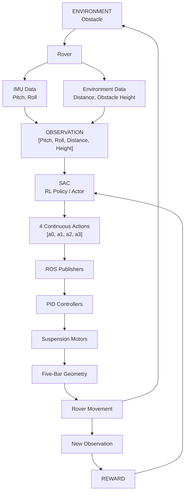

# Active Five-Bar Suspension for Obstacle Crossing

## The Problem

Planetary rovers have to travel over rough, uneven terrain while carrying sensitive scientific equipment.

The paper referenced "[LINK](https://arxiv.org/abs/2406.18899)" focuses on a specific problem:

> How can a rover actively adjust its suspension so that it can climb large obstacles while keeping its chasis stable?

Traditional Mars rovers commonly use rocker-bogie suspension. It provides good stability and wheel-ground contact, but it can suffer from bogic overturn, where the bogie rotates more than 90 deg. and the rover becomesm immobilized. The paper also points out that passive mechanisms react to terrain forces rather than proactively changing their geometry.

---

## The Proposed Solution

The authors propose:

- A modified five-bar suspension mechanism
- An active suspension using actuators on the control links
- Deep reinforcement learning to decide how those links should move
- Specifically, Soft Actor-Critic(SAC) for continuous control
- PID controllers to physically make the motors reach the angles commanded by SAC
- Gazebo + ROS for simulation and control integration

The basis idea is:

1. Obstacle + rover condition
2. SAC observes
   [pitch, roll, distance, height]
3. SAC predicts 4 control angles
4. PID controllers
5. Suspension actuators
6. Rover changes suspension geometry
7. Rover crosses obstacle
8. New state
9. reward
10. SAC learns

The paper explicitly describes SAC as predicting the required control-link angles, ater which PID control actuates the links.

---

## Main Results

The paper reports:

- Passive suspension peak pitch: 21.31°
- Active suspension peak pitch: 10.73°
- Reduction: 10.58°
- Active Suspension maintains approximately 0.7m/s traversal velocity over the 32 cm obstacle.
- SAC converges in considerably fewer timesteps than the tested DDPG, TD3 and PPO baselines.
- The authors report successful convergence within 4 hours of training without a powerful GPU.

Limitation as mentioned in the paper includes:

- The results are from simulation, and whether the same effects occur in practical physical deployment still requires validation.

---

## System Pipeline

### S1 - Environment

The rover encounters an obstacle. The training environment randomly generates an obstacle between: 25 cm and 32 cm height,

The obstacle has a vertical face perpendicular to the ground and is intentionally placed so that it is unavoidable - the rover must cross it to reach the goal.

### S2 - Observation

The rover recieves : [Pitch, roll, distance, height], This is a 4 dimensional observation,

- Pitch = chassis longitiduinal inclination
- Roll = chassis lateral inclination
- Distance = rover distance from obstacle
- height = obstacle height

Pitch and roll come from the IMU; distance and obstacle height come from the environment.

The agent does not receive the complete environment. It gets a compact observation consisting of chassis pitch, roll, distance to the obstacle and obstacle height, so the problem is treated as partially observed.

---

## 3. Core Concepts

### 3.1) 5-Bar mechanism

A five-bar mechanism is a closed-chain linkage consisting of five links connected through joints.

In the context of this project, the chassis acts as Link 5. The suspension uses the closed-chain-planar 5-bar-mechanism as its structural basis. The outer wheels are mounted on extrapolated sections of links 1 and 2, while the middle wheel is mounted at the revolute joint between them.

### 3.2) Active vs Passive suspension

Passive:

A passive suspension responds mechanically to the forces.

Typical components:

- springs
- shock absorbers

It cannot actively change its geometry or suspension parameters according to terrain conditions.

Active:

An active suspension uses actuators to deliberately change suspension geometry.

Here, actuators control the rotations between them:

- Link 3 <-> Link 5
- Link 4 <-> Link 5

Core Distinction:

- Passive: terrain → mechanical reaction
- Active: observation → controller decision → actuator → suspension movement

### 3.3) Chasis Pitch

The angle between the longitudinal axis of the chassis and the ground plane. Large pitch means the rover is tilting forward/backward. The paper assosciates high pitch with increased toppling risk and undesirable inertial forces on onboard scientific equipments.

### 3.4) Roll

The angle between the lateral axis of the chassis and the ground. Roll represents side-to-side chassis inclination. The paper includes roll in the observation because lateral stability matters during traversal.

