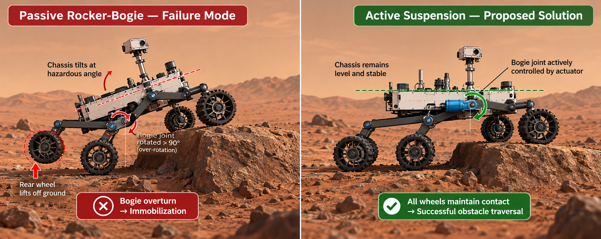
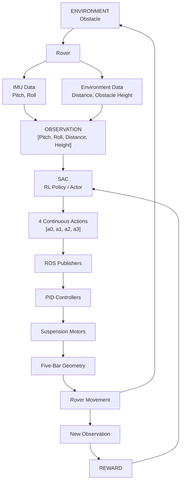
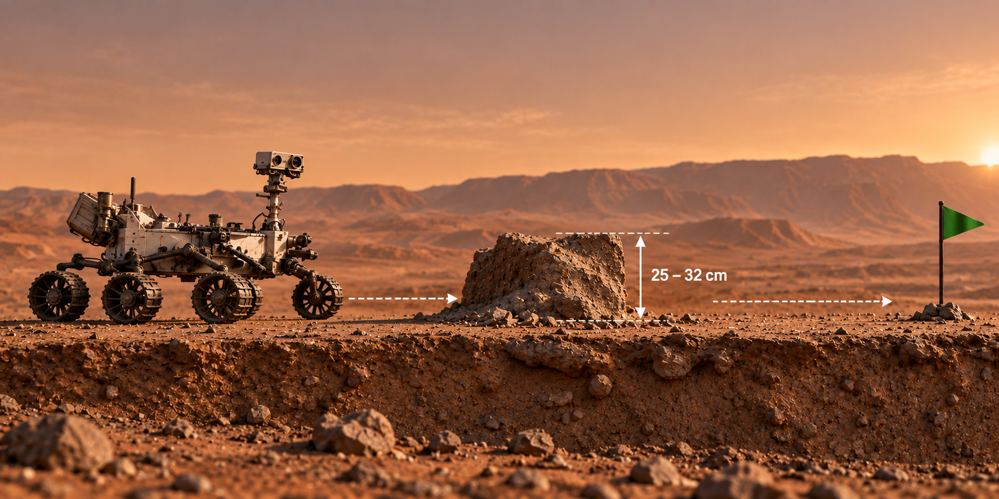
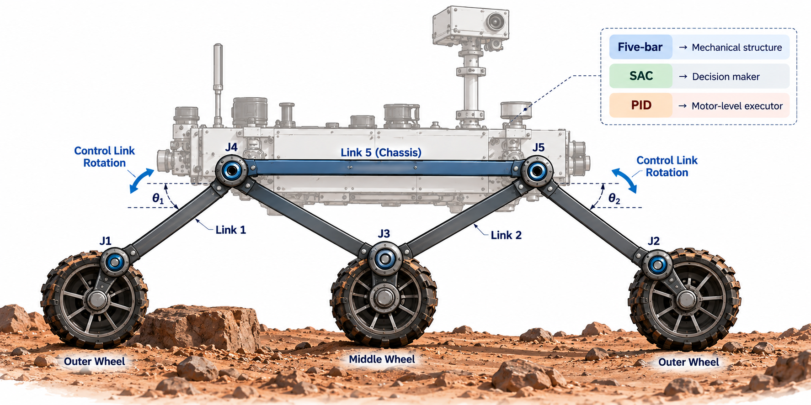
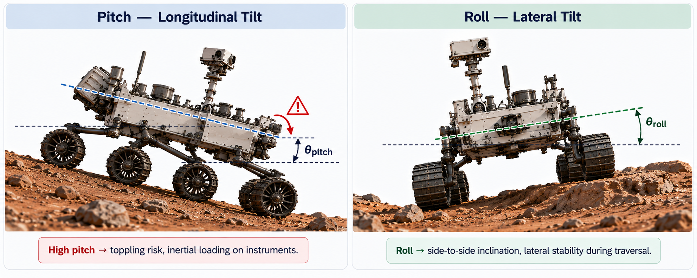
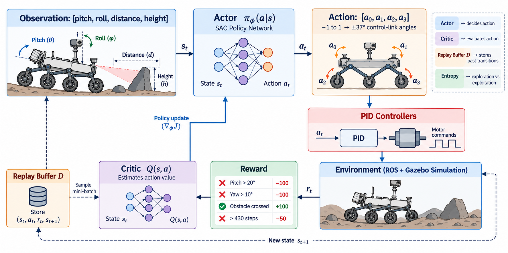

# Active Five-Bar Suspension for Obstacle Crossing

## The Problem

Planetary rovers have to travel over rough, uneven terrain while carrying sensitive scientific equipment.

The paper referenced "[LINK](https://arxiv.org/abs/2406.18899)" focuses on a specific problem:

> How can a rover actively adjust its suspension so that it can climb large obstacles while keeping its chasis stable?

Traditional Mars rovers commonly use rocker-bogie suspension. It provides good stability and wheel-ground contact, but it can suffer from bogic overturn, where the bogie rotates more than 90 deg. and the rover becomesm immobilized. The paper also points out that passive mechanisms react to terrain forces rather than proactively changing their geometry.



---

## The Proposed Solution

The authors propose:

- A modified five-bar suspension mechanism
- An active suspension using actuators on the control links
- Deep reinforcement learning to decide how those links should move
- Specifically, Soft Actor-Critic(SAC) for continuous control
- PID controllers to physically make the motors reach the angles commanded by SAC
- Gazebo + ROS for simulation and control integration

The basis idea is:

1. Obstacle + rover condition
2. SAC observes
   [pitch, roll, distance, height]
3. SAC predicts 4 control angles
4. PID controllers
5. Suspension actuators
6. Rover changes suspension geometry
7. Rover crosses obstacle
8. New state
9. reward
10. SAC learns

The paper explicitly describes SAC as predicting the required control-link angles, ater which PID control actuates the links.

---

## Main Results

The paper reports:

- Passive suspension peak pitch: 21.31°
- Active suspension peak pitch: 10.73°
- Reduction: 10.58°
- Active Suspension maintains approximately 0.7m/s traversal velocity over the 32 cm obstacle.
- SAC converges in considerably fewer timesteps than the tested DDPG, TD3 and PPO baselines.
- The authors report successful convergence within 4 hours of training without a powerful GPU.

Limitation as mentioned in the paper includes:

- The results are from simulation, and whether the same effects occur in practical physical deployment still requires validation.

---

## System Pipeline




### S1 - Environment

The rover encounters an obstacle. The training environment randomly generates an obstacle between: 25 cm and 32 cm height,

The obstacle has a vertical face perpendicular to the ground and is intentionally placed so that it is unavoidable - the rover must cross it to reach the goal.



### S2 - Observation

The rover recieves : [Pitch, roll, distance, height], This is a 4 dimensional observation,

- Pitch = chassis longitiduinal inclination
- Roll = chassis lateral inclination
- Distance = rover distance from obstacle
- height = obstacle height

Pitch and roll come from the IMU; distance and obstacle height come from the environment.

The agent does not receive the complete environment. It gets a compact observation consisting of chassis pitch, roll, distance to the obstacle and obstacle height, so the problem is treated as partially observed.

---

## 3. Core Concepts

### 3.1) 5-Bar mechanism

A five-bar mechanism is a closed-chain linkage consisting of five links connected through joints.

In the context of this project, the chassis acts as Link 5. The suspension uses the closed-chain-planar 5-bar-mechanism as its structural basis. The outer wheels are mounted on extrapolated sections of links 1 and 2, while the middle wheel is mounted at the revolute joint between them.



### 3.2) Active vs Passive suspension

Passive:

A passive suspension responds mechanically to the forces.

Typical components:

- springs
- shock absorbers

It cannot actively change its geometry or suspension parameters according to terrain conditions.

Active:

An active suspension uses actuators to deliberately change suspension geometry.

Here, actuators control the rotations between them:

- Link 3 <-> Link 5
- Link 4 <-> Link 5

Core Distinction:

- Passive: terrain → mechanical reaction
- Active: observation → controller decision → actuator → suspension movement

### 3.3) Chasis Pitch

The angle between the longitudinal axis of the chassis and the ground plane. Large pitch means the rover is tilting forward/backward. The paper assosciates high pitch with increased toppling risk and undesirable inertial forces on onboard scientific equipments.

### 3.4) Roll

The angle between the lateral axis of the chassis and the ground. Roll represents side-to-side chassis inclination. The paper includes roll in the observation because lateral stability matters during traversal.



### 3.5) Obstacle traversal

Getting the rover over the obstacle while maintaining stability and progressing towards the goal. The paper emphasizes traversability: the ability to cross uneven terrain while maintaining ground contact with as many wheels as possible.

### 3.6) Reinforcement learning

An agent learns by taking actions in an environment and recieving rewards.

```text
State
  ↓
Action
  ↓
Environment
  ↓
Reward + new state
  ↓
Learn better policy
```

The objective is cumulative reward.

Example:

- Good suspension -> rover crosses obstacle -> +100 reward
- Bad pitch -> -100 reward and episode ends

### 3.7) MDP (Markov Decision Process)

The paper represents it as: (S, A, P, R)

where:

- S = State space
- A = Action space
- P = Transition probability function
- R = Reward function

### 3.8) State/Observation

Observation: what the agent actually recieves: [pitch, roll, distance, height]

State: the paper places those observations within the state-space.

State is the underlying situation; observation is the information available to the agent about that situation. The paper explicitly notes that the rover does not have complete environmental information and describes the setup as partially observed.

### 3.9) Action Space

The action is:

```text
[a0, a1, a2, a3]
```

Each is bounded:

- -1 ≤ ai ≤ 1

These normalized actions are converted to physical angles by multiplying by 37°, the maximum allowed control link angle.

Therefore:

- -1 -> -37°
- 0 -> 0°
- 1 -> 37°

The paper describes a0 and a1 as actuating control links for the middle and rear pair, and a2 and a3 as actuating control links associated with the two wheels approaching the obstacle.

### 3.10) Reward

Reward tells SAC whether an action was useful.

Paper's reward:

| Condition | Reward | Episode |
| --- | ---: | --- |
| pitch > 20° | −100 | ends |
| yaw > 10° | −100 | ends |
| obstacle crossed | +100 | ends |
| not crossed after >430 steps | −50 | ends |

The paper says no intermediate rewards were required. Successful obstacle crossing gives the positive reward.

### 3.11) Policy

A policy tells the agent:

> Given my current state, what action should I take?

The paper represents it as:

$$ \pi_\phi(a_t|s_t) $$

### 3.12) Actor

The actor represents the policy.

It answers:

> Given the current observation, what action should I take?

In this paper, that means predicting the four control-link actions.

### 3.13) Critic

The critic estimates:

> How good is this state/action combination?

It uses a Q-function.

### 3.14) Q-function

A Q-function estimates the expected future return from taking action a in state s.

Conceptually:

```text
Q(s, a) = how valuable is action a when I'm in state s?
```

SAC uses two soft Q-functions.

### 3.15) Replay buffer

A replay buffer stores previous experiences:

```text
(state, action, reward, next state)
```

The paper calls this the replay pool D.

Why?

Instead of learning only from the newest transition, SAC can repeatedly sample old experiences to train the networks.

### 3.16) Entropy

Entropy measures the randomness/uncertainty of the policy.

High entropy:

- more exploration

Low entropy:

- more deterministic behaviour

SAC maximizes:

```text
reward + α × entropy
```

The paper says the maximum-entropy objective encourages wider exploration while dropping unpromising avenues.

### 3.17) SAC (Soft Actor-Critic)

It is:

- an off-policy, maximum-entropy deep reinforcement learning algorithm designed particularly for continuous action spaces.

The paper chose it because the control problem has continuous actions and because prior SAC work reported good generalization in real-world robotics.

### 3.18) PID (Propotional Integral Derivative) controller

In this paper, PID is not the high-level decision maker.

SAC says:

> Move this control link to this angle.

PID makes the motor actually achieve that desired angle.

The paper says the PID controllers were manually tuned and attached to the four control-link motors.

### 3.19) ROS

ROS is the robotics middleware connecting components.

In this paper, ROS integrates:

- sensors
- controllers
- robot simulation
- joint commands

The paper uses ROS with Gazebo and ROS publishers to send joint position commands.

### 3.20) Gazebo

Gazebo is the robot simulation environment. The authors simulate the rover and terrain there rather than immediately testing everything on hardware.

### 3.21) IMU (Inertial Measurement Unit)

Here it provides the rover's Euler-angle variations, which are used for pitch and roll.

